# Cine App

Self-hosted PWA dashboard for managing a cinema/media stack from one mobile-friendly interface.

Cine App brings together Radarr, Sonarr, Bazarr, Jackett, qBittorrent, Jellyfin and Jellyseerr into a single dashboard designed for daily use, on desktop and mobile.

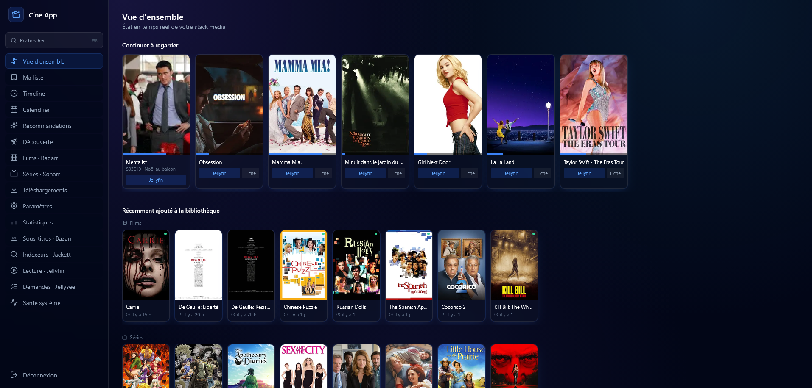 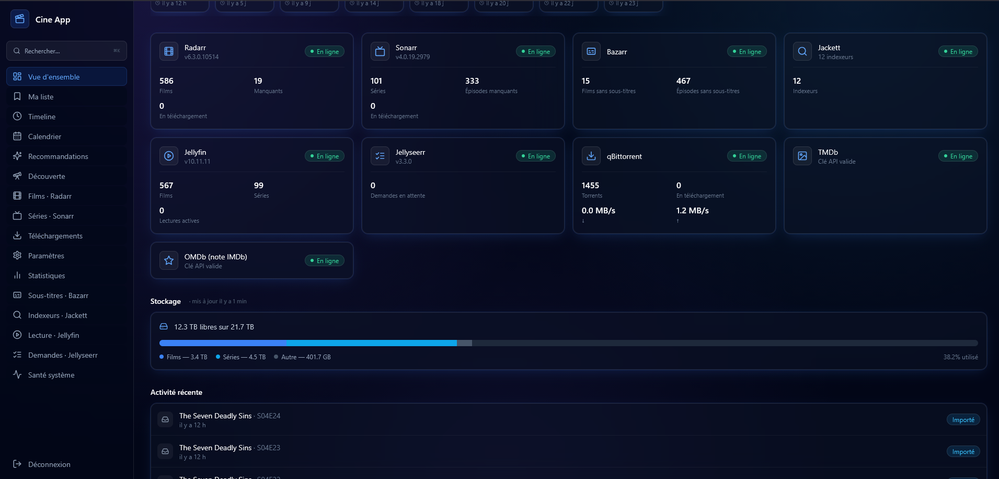
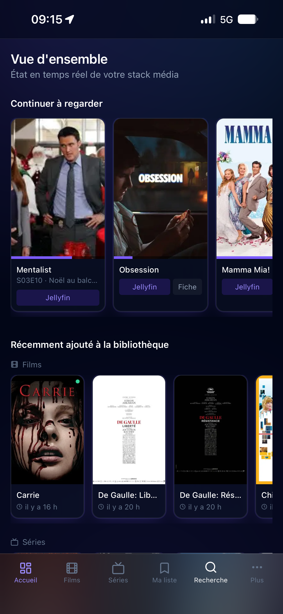

---

## Features

### Library & Media Management

- **Radarr and Sonarr library views** - grid and list modes, filtering, quick search, keyboard navigation
- **Movie and series detail pages** - poster, metadata, cast carousel, active downloads, file info, IMDb/RT/Metacritic ratings

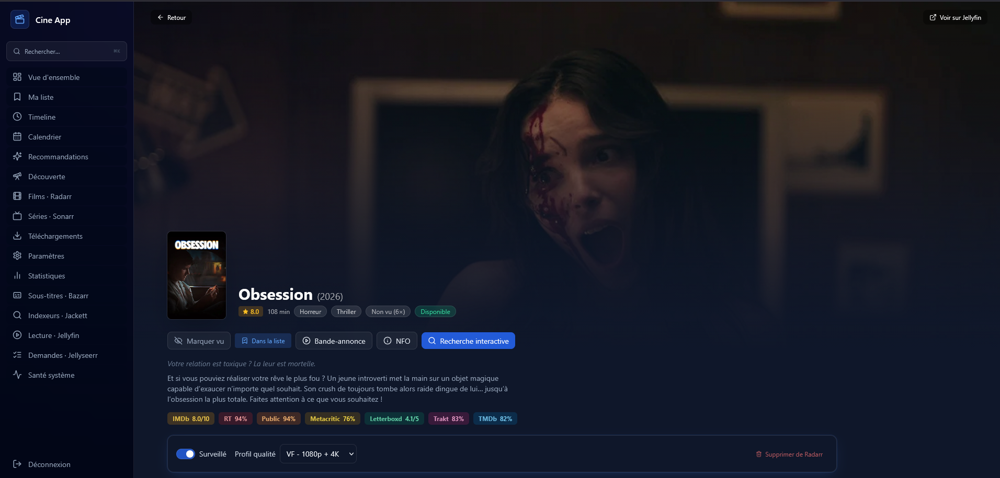 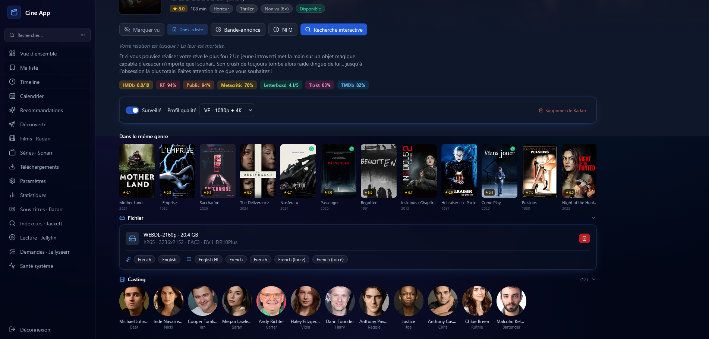
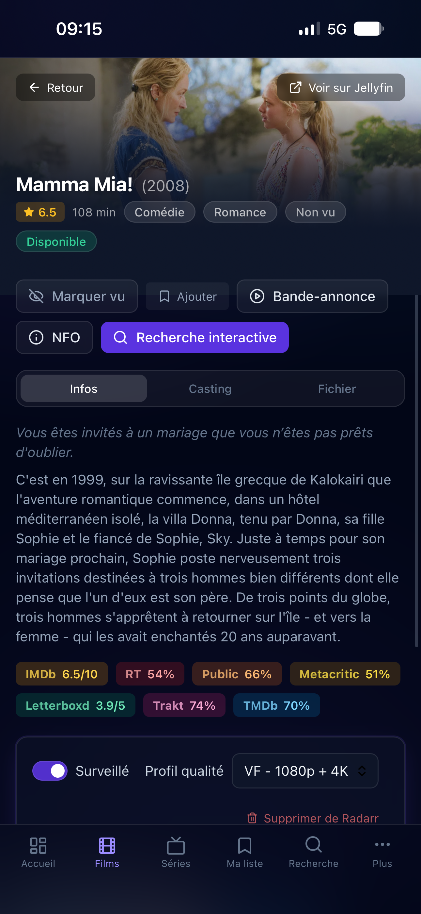
- **Watchlist** - add any title from TMDB, classify with 5 statuses (A voir, Favoris, Vus, A demander, Abandonnes), personal notes, search and sort, IMDb rating badge on every card

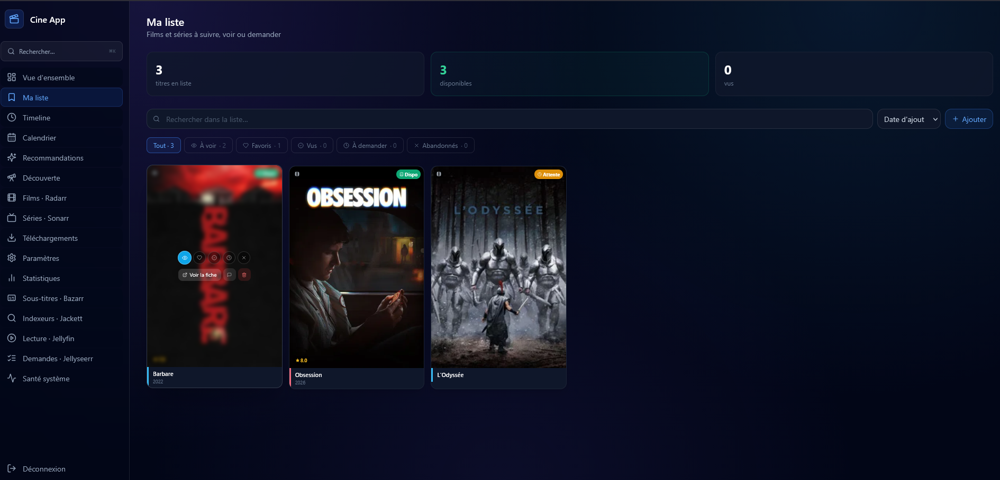 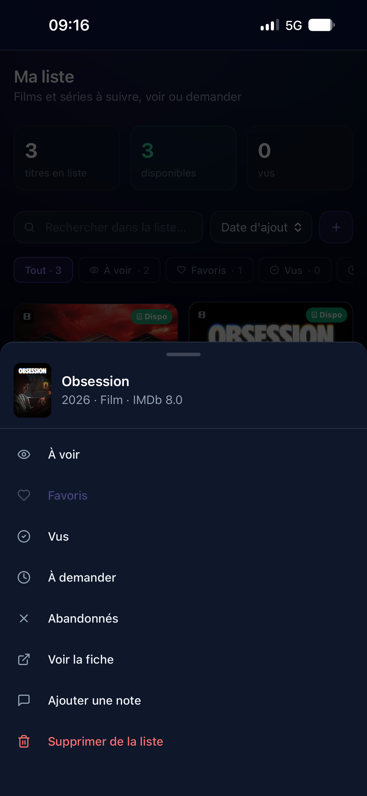
- **Natural language search** - find titles with queries like `film de guerre de Christopher Nolan`, `serie avec Clara Galle` or `film comedie avec Ryan Gosling`

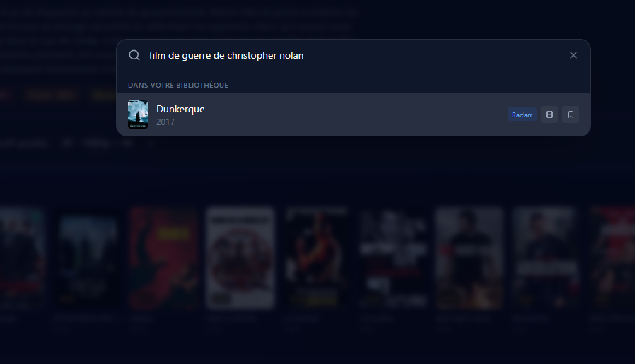 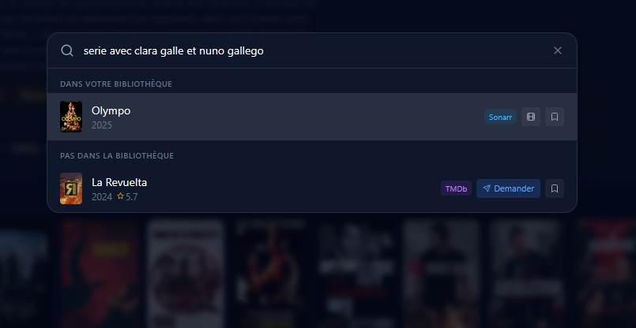 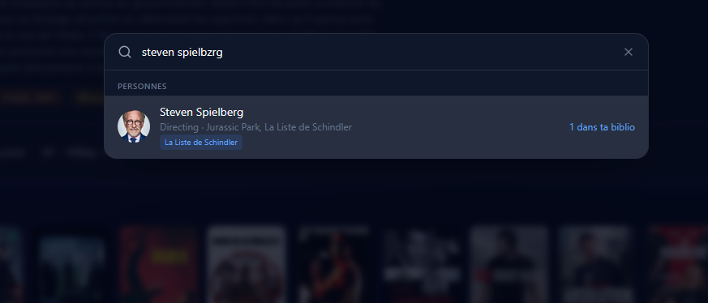
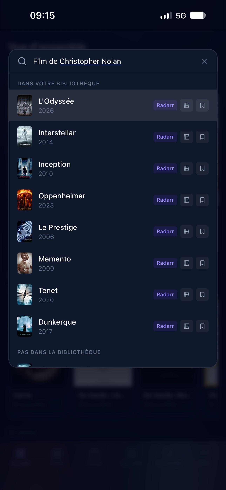
- **Discover** - trending movies and series with genre filters, TMDB search, "Pour vous" tab based on Jellyfin play history
- **Recommendations** - personalised rows based on recently watched Jellyfin history
- **Release search modal** - browse and grab releases directly from Radarr/Sonarr inside the app
- **Interactive search** - admin-only Telescope button on Watchlist, Discover and Recommendations cards to add a title and open the release search in one step
- **Remove from Radarr/Sonarr** - discrete button on detail pages with in-app confirmation modal

### Unified Visual Identity

All media grids (Watchlist, Discover, Recommendations) share the same card design:

- Poster-only card with `aspect-[2/3]`
- **Desktop** - hover overlay with 5 status buttons, Voir la fiche / Demander, and admin Recherche interactive
- **Mobile** - tap to open an ActionSheet with real-time swipe-to-close gesture
- **IMDb rating badge** - always visible bottom-left, fetched via OMDB API
- **"Dispo" badge** (green) - file actually downloaded
- **"Attente" badge** (amber) - monitored in Radarr/Sonarr but not yet available
- **Delete confirmation** - native in-app modal before removing from watchlist

### Jellyfin Integration

- Resume watching section with per-user progress
- Recently added and recently played
- Mark watched / unwatched from any detail page
- Per-user recommendations based on play history

### Requests & Downloads

- **Jellyseerr request management** - send, track and display requests with status badges
- **qBittorrent monitoring** - live torrent list with section separators (En cours / Seed / Pauses), progress bars, speed indicators, start/stop/remove actions

### Calendar & Timeline

- Media release calendar (upcoming Radarr/Sonarr entries)
- Activity timeline

### Ratings

- **MDBList** - IMDb, Rotten Tomatoes, Metacritic, Letterboxd, Trakt on detail pages
- **OMDB** - IMDb rating fetched per-item on Watchlist cards, cached 24 h server-side
- TMDB vote average shown on Discover and Recommendations cards

### Stats

- Top actors and directors ranked by number of titles in the library
- Accurate library/person statistics across movies and series

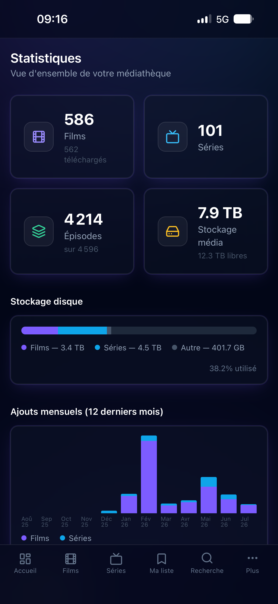

### Other

- Service health dashboard

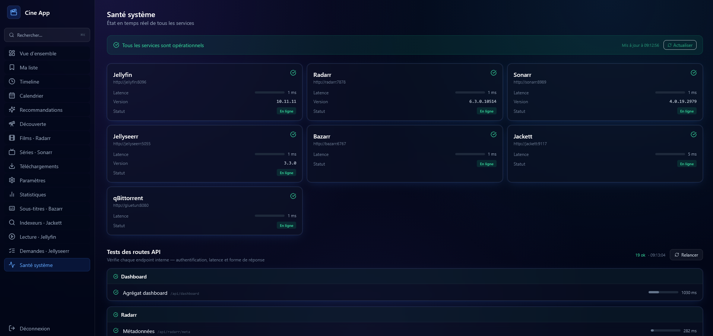

- Bazarr subtitle management per episode
- NFO viewer
- Actor / person modal with filmography

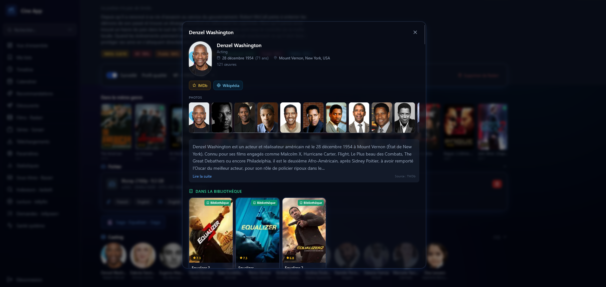 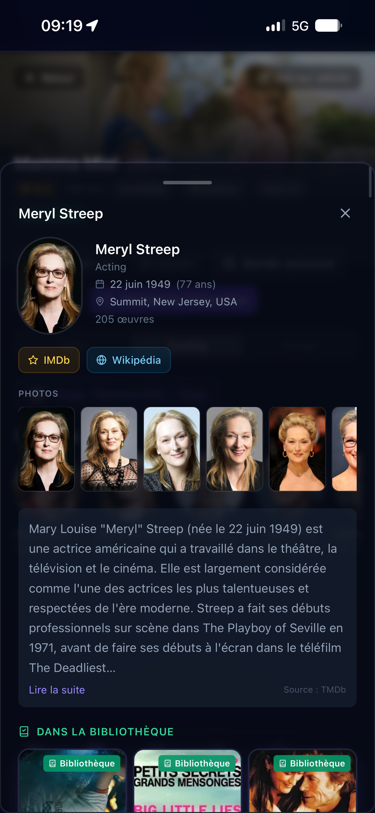
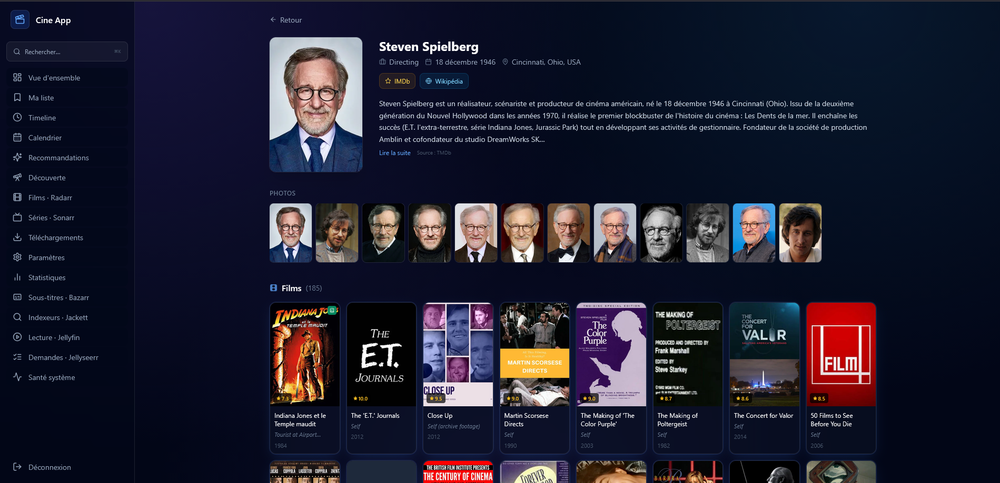 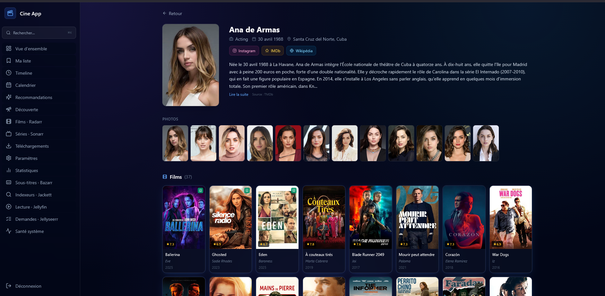

- Collection modal (saga grouping)
- Trailer modal
- Installable PWA
- Web Push notifications including iOS Safari / Apple Web Push
- Mobile-first navigation with haptic feedback

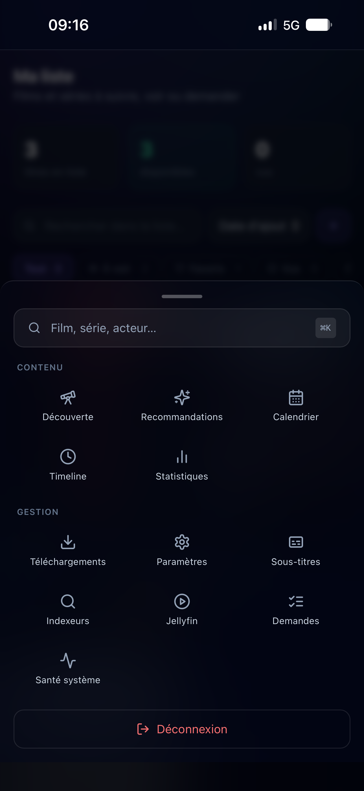

- Guest mode (read-only, watchlist allowed)
- Admin mode (full access including interactive search and deletion)

---

## Requirements

- Docker / Docker Compose
- Existing media stack services (see https://github.com/LK59/cinema)
- API keys for Radarr, Sonarr, Bazarr, Jackett, Jellyfin and Jellyseerr
- A shared Docker network with your media services

---

## Deployment

Create your environment file:

```bash
cp .env.example .env
```

Edit `.env` and configure:

| Variable | Description |
|---|---|
| `ADMIN_USERNAME` / `ADMIN_PASSWORD` | Local Cine App admin fallback account |
| `SESSION_SECRET` | Secret used to sign sessions |
| `RADARR_URL` / `RADARR_API_KEY` | Radarr connection |
| `SONARR_URL` / `SONARR_API_KEY` | Sonarr connection |
| `JELLYFIN_URL` / `JELLYFIN_API_KEY` | Jellyfin connection |
| `JELLYSEERR_URL` / `JELLYSEERR_API_KEY` | Jellyseerr connection |
| `QBITTORRENT_URL` / `QBITTORRENT_*` | qBittorrent credentials |
| `TMDB_API_KEY` | Required for Discover, Recommendations and person/media metadata |
| `OMDB_API_KEY` | Optional - IMDb ratings on Watchlist cards |
| `MDBLIST_API_KEY` | Optional - multi-source ratings on detail pages |
| `APP_LANGUAGE` | Default instance language (`fr` \| `en` \| `es` \| `de`) — used for accounts with no saved preference and on the login page (default: `en`) |
| `VAPID_*` | Optional - Web Push notifications |

### Docker Compose Setup

Copy the example compose file, then adapt it to your infrastructure:

```bash
cp docker-compose.example.yml docker-compose.yml
nano docker-compose.yml
```

`docker-compose.yml` is intentionally ignored by git. Keep your production compose local to your server, and commit changes to `docker-compose.example.yml` when you want to update the public template.

`docker-compose.example.yml` uses the pre-built image published on GitHub Container Registry — no build tools, no source checkout required:

```yaml
services:
  cine-app:
    image: ghcr.io/lk59/cine-app:latest
    container_name: cine-app
    env_file:
      - .env
    ports:
      - "3000:3000"
    volumes:
      - ./data:/app/data
    networks:
      - media

networks:
  media:
    external: true
```

The `data` volume stores local app data such as the SQLite database. Do not commit it to git.

In your local `docker-compose.yml`, adapt:

- the external Docker network name;
- the timezone (`TZ`);
- the host media path mounted read-only;
- optional gallery/photo mounts;
- the `ports` section if you want direct access without a reverse proxy.

<details>
<summary>Building from source instead (only if you're modifying the code)</summary>

Replace the `image:` line with:

```yaml
build:
  context: .
  dockerfile: Dockerfile
```

Then use `docker compose up -d --build` instead of `docker compose pull` everywhere below. The build runs the test suite first — it fails loudly instead of shipping a broken image.

</details>

### Network / Service URLs

Cine App must be able to reach Radarr, Sonarr, Jellyfin, Jellyseerr, qBittorrent and the other services from inside the container.

Recommended setup:

- Put Cine App on the same Docker network as the rest of your media stack.
- Use Docker service names in `.env`, for example `http://radarr:7878`, `http://sonarr:8989`, `http://jellyfin:8096`.

Alternative setup:

- Use reachable LAN URLs or reverse-proxy URLs if your services are not on the same Docker network.
- Make sure those URLs are reachable from the Cine App container, not only from your browser.

Start the app:

```bash
docker compose pull
docker compose up -d
```

The app listens on port `3000` inside Docker. Use a reverse proxy (Nginx Proxy Manager, Traefik, Caddy) or expose the port directly for testing.

### First Login

Open Cine App through your configured URL.

For normal users, log in with an existing Jellyfin username and password.

For setup or maintenance, use the local admin account configured with `ADMIN_USERNAME` and `ADMIN_PASSWORD`.

### Updating

```bash
docker compose pull
docker compose up -d
```

### After Changing `.env`

Most configuration is read by the server process. After changing `.env`, restart the container so the new values are loaded:

```bash
docker compose up -d
```

This restart command is safe to use after any configuration change.

---

## Authentication

Cine App supports two authentication methods.

### Jellyfin Users (Recommended)

Existing Jellyfin users can log in with their Jellyfin username and password.

This is the recommended login method for normal users because Cine App can associate the session with the Jellyfin user account. This enables per-user resume watching, play history, watched/unwatched actions and personalised recommendations.

Jellyfin administrator accounts are granted admin access in Cine App. Non-admin Jellyfin users are logged in as guest/read-only users.

### Local Admin Fallback

`ADMIN_USERNAME` and `ADMIN_PASSWORD` define a local Cine App admin account, independent from Jellyfin.

Use it as a fallback/admin account for setup and maintenance.

---

## Optional Configuration

### Push Notifications

Cine App supports Web Push notifications for installed PWAs, including iOS Safari / Apple Web Push.

Web Push requires a VAPID key pair. These keys are not tied to a specific machine: they are just two secret strings that you generate once, then copy into the `.env` used by Cine App.

You can generate them in any of these environments:

- **On your Cine App server**, if Node.js/npm is installed.
- **On your local computer**, if Node.js/npm is installed, then copy the generated values to the server.
- **With Docker**, if you do not want to install Node.js/npm anywhere.

Option A - generate with Node.js/npm:

```bash
npx web-push generate-vapid-keys
```

Option B - generate with Docker:

```bash
docker run --rm node:20-alpine sh -lc "npm install -g web-push >/dev/null && web-push generate-vapid-keys"
```

The command prints something like:

```text
Public Key:
...

Private Key:
...
```

Copy these two values into the `.env` file on the host running Cine App, in the same directory as `docker-compose.yml`:

```env
VAPID_PUBLIC_KEY=
VAPID_PRIVATE_KEY=
VAPID_SUBJECT=mailto:admin@example.com
```

`VAPID_SUBJECT` can be any contact URI controlled by the administrator, usually an email address.

Then restart the Cine App container so the new environment variables are loaded:

```bash
docker compose up -d
```

After deployment, open Cine App as a user, go to **Settings -> Notifications**, enable push notifications for the current browser/PWA, then use the test button to confirm delivery.

### MDBList (Detail Pages)

Multi-source ratings on movie and series pages: IMDb, Rotten Tomatoes, Metacritic, Letterboxd, Trakt - all from a single API call.

Get a free key at **mdblist.com -> Settings -> API Key** (free tier: 1 000 req/day).

```env
MDBLIST_API_KEY=your_key_here
```

### OMDB (Watchlist Cards)

IMDb ratings displayed as a badge on each Watchlist card, fetched via the OMDB API and cached 24 h server-side.

Get a free key at **omdbapi.com** (free tier: 1 000 req/day).

```env
OMDB_API_KEY=your_key_here
```

Without these keys the rating sections are simply not shown. No rebuild is needed if keys are added after first launch; the app reads them at runtime.

### Clara Galle Gallery Page

Cine App includes an optional enriched page for the actress Clara Galle, with a full-screen photo gallery, detailed biography and external links.

This feature is disabled by default and requires a local photo folder on your host.

#### Enable It

Create a folder anywhere on your host and add your photos (JPG, PNG or WebP).

Also place a file named exactly `clarabanner.jpg` in the same folder. It is used as the full-width banner at the top of the page.

Do not commit this folder or its contents to git.

Mount the folder in your compose file:

```yaml
volumes:
  - /path/to/your/clara/photos:/app/gallery/clara:ro
```

See `docker-compose.example.yml` for the full example.

Set the env var:

```env
CLARA_GALLERY_ENABLED=true
```

Restart:

```bash
docker compose up -d
```

#### Disable It

Set `CLARA_GALLERY_ENABLED=false` (or remove the variable) and restart.

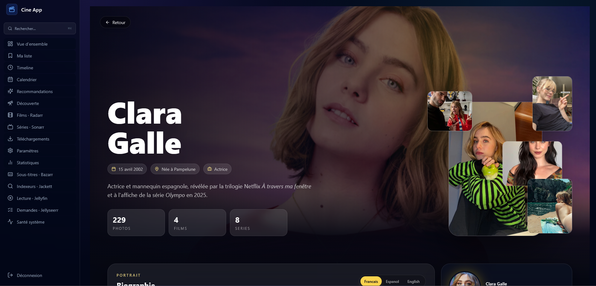 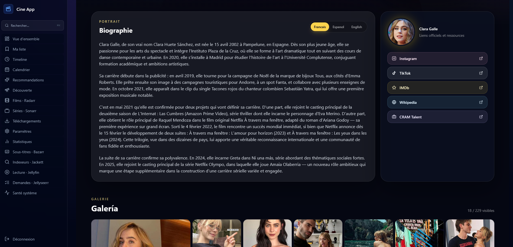
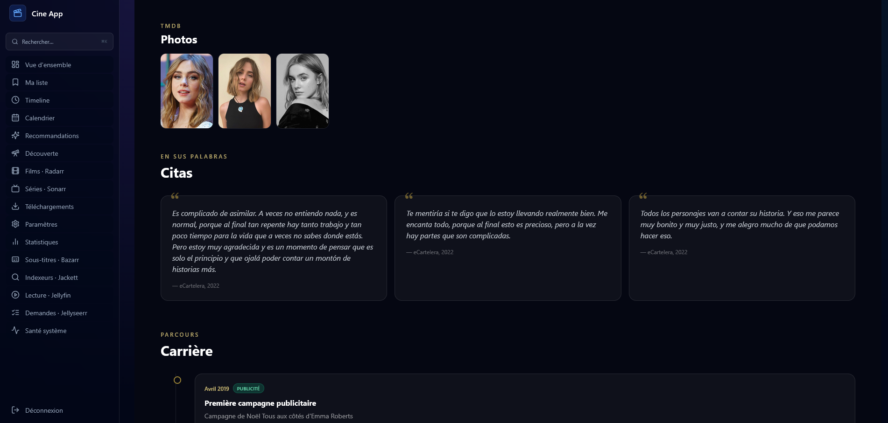 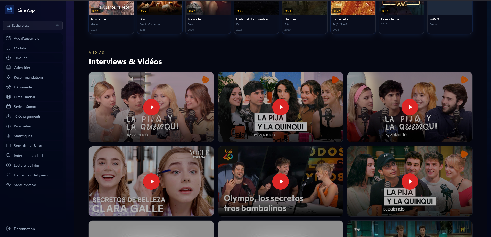

---

## Security

Never commit:

```text
.env
data/
*.db
*.db-wal
*.db-shm
```

All service API keys are kept server-side and are never exposed to the browser.

---

## Troubleshooting

### App Cannot Reach Radarr / Sonarr / Jellyfin

Check that:

- the service URL in `.env` is reachable from inside the Cine App container;
- Cine App is attached to the same Docker network as your media services, or uses reachable LAN/proxy URLs;
- the API key is correct;
- the target service is running.

If you use Docker service names, the name must match the service/container DNS name on the shared network.

### Jellyfin Login Fails

Check that:

- `JELLYFIN_URL` points to the internal URL reachable by Cine App, for example `http://jellyfin:8096`;
- the Jellyfin username/password works directly in Jellyfin;
- the Jellyfin server is reachable from the Cine App container.

The local admin login (`ADMIN_USERNAME` / `ADMIN_PASSWORD`) is independent from Jellyfin and can be used as a fallback.

### Push Notifications Do Not Appear

Check that:

- `VAPID_PUBLIC_KEY`, `VAPID_PRIVATE_KEY` and `VAPID_SUBJECT` are set in `.env`;
- the app was rebuilt/restarted after setting them;
- the app is served over HTTPS, which is required by most browsers for Web Push;
- notifications are enabled in **Settings -> Notifications** for the current browser or installed PWA;
- browser or OS notification permissions are not blocked.

On iOS, install the app to the Home Screen first, then enable notifications from inside the installed PWA.

### Recommendations Are Empty

Check that:

- `TMDB_API_KEY` is configured;
- the logged-in Jellyfin user has watch history;
- Cine App was opened with Jellyfin authentication, so it can associate the session with a Jellyfin user.

### Ratings Are Missing

Check that:

- `MDBLIST_API_KEY` is set for detail-page multi-source ratings;
- `OMDB_API_KEY` is set for IMDb badges on Watchlist cards;
- API free-tier limits have not been reached.

Without these keys, the app still works; the rating sections are simply hidden.

---

## Notes

qBittorrent can be reached through a Gluetun container when it shares the same network namespace:

```env
QBITTORRENT_URL=http://gluetun:8080
```

Adjust this value depending on your own stack.
